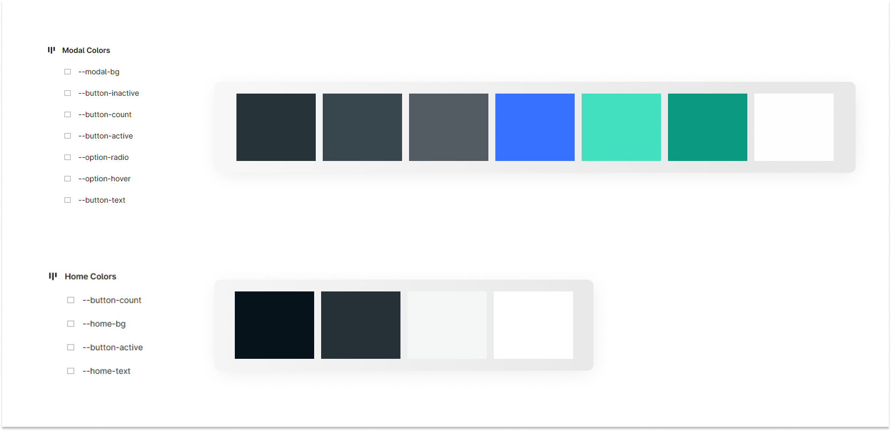

### poke-palette

A keyboard-first command palette to quickly select your best pokemon.

Pre work:

- https://pokeapi.co/docs/graphql
- https://www.youtube.com/watch?v=vUlnxjuYyzw: A video on keyboard shortcuts
- https://github.com/pacocoursey/cmdk: The famous `cmdk` repo
- Inspiration from tldraw's menu (steve ruiz): https://twitter.com/steveruizok/status/1557307223465943040

#### Potential Plan of Action

Steps 

1. Implement Modal Open and Close

`Ctrl + K`: Open Modal
`Esc`: Close Modal

Note: When opening modal, a primary (default) filter is set/selected.

**Potential Improvement** — Use Mousetrap to cover edge cases: https://craig.is/killing/mice

2. Identify Filters

Pokemons
- Generation
  - Gen I
  - Gen II
  - Gen III
- Color
  - Red
  - Green
  - Blue 
- Habitat (Checkbox)
  - Grassland
  - Mountain 
  - Water

Moves
- Move Class
  - Physical
  - Special
  - Status
- Power Points
  - above 10
  - above 15
  - above 20
 
3. Identify Broad Components

- Modal
- Filter Box
  - Name + <?num> + `>`
- Select Filter
  - <radio/check> + Filter Name
- CTA 
  - Show Results (Primary)
  - Reset (Secondary)
- Results

3.1 Identify Color palette

- [Helper Figma File](https://www.figma.com/file/eDZRFZeOC4THv4tlRERQz9/Untitled?type=design&node-id=0%3A1&t=9xz32ZVFm1rPyOug-1)
- Define these variables in [index.css](./src/index.css) 

4. Figure out GraphQL

- https://www.freecodecamp.org/news/5-ways-to-fetch-data-react-graphql/amp
- https://graphql.org/learn 
- Use Apollo Client

### Challenges

0. _Trying_ to override `Ctrl + K`'s browser shortcut the vanilla way (without any libraries): [App.js](./src/App.js)
1. Observing and defining the structure of the collapsible menu: [struct.js](./src/utils/struct.js)
2. Proposing an over-engineered recursive <Box/> component: [Box.jsx](/src/components/box/Box.jsx)
3. Writing the recursive traverse through function to update/access the globalState: [Box.jsx](/src/components/box/Box.jsx)
4. Trying to do things in a vanilla fashion, rather than importing yet another library.
